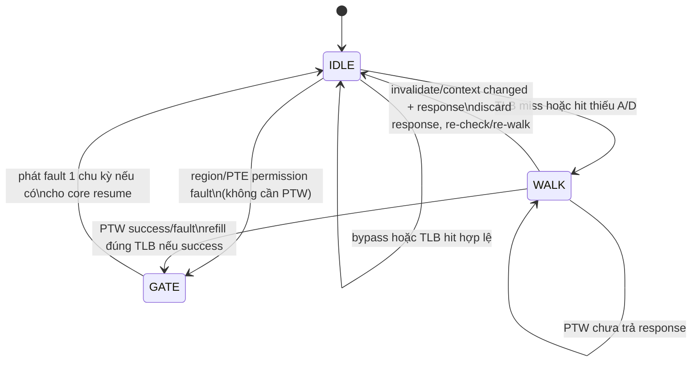
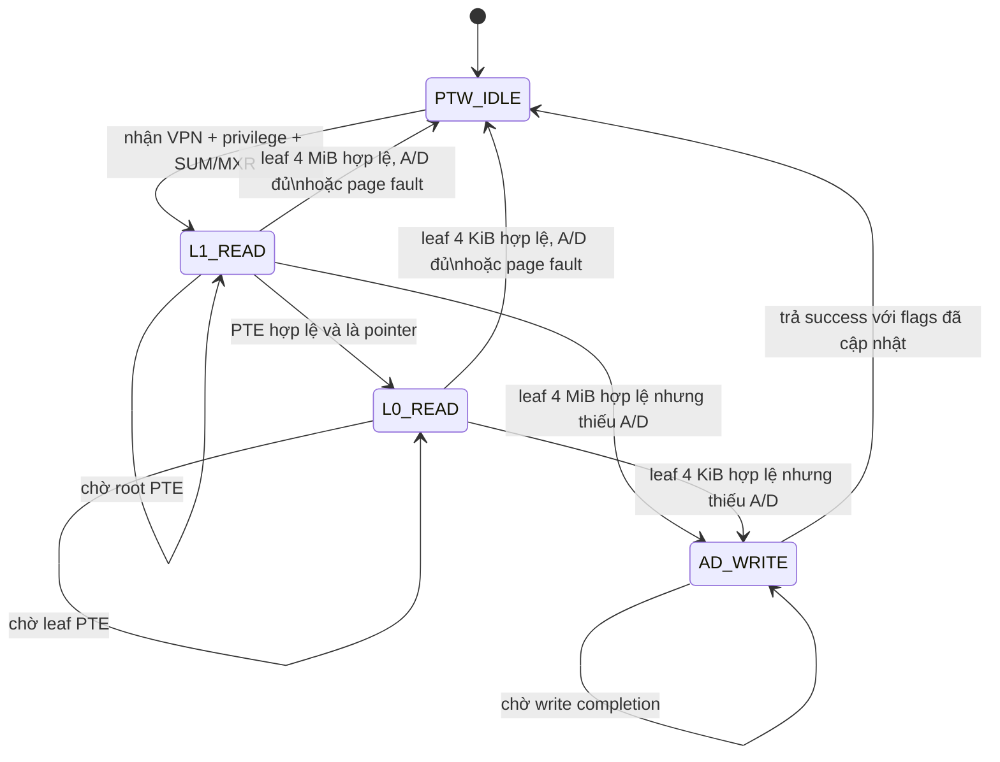

# FSM điều khiển MMU

Tài liệu này mô tả đúng RTL hiện tại trong `Risc_V/rtl/mmu/mmu_top.v` và
`Risc_V/rtl/mmu/mmu_ptw.v`. MMU dùng hai FSM lồng nhau: FSM ngoài phân xử yêu cầu
iTLB/dTLB và tạo nhịp fault/resume; FSM trong thực hiện page-table walk và cập nhật
bit Accessed/Dirty.

## 1. FSM điều phối ở `mmu_top`

| State | `busy` | Hành động chính | Điều kiện rời state |
|---|---:|---|---|
| `IDLE` | 0 khi không có vấn đề; lên 1 ngay trong chu kỳ phát hiện | Dịch tổ hợp trên hit; kiểm tra region, R/W/X, U/S, SUM/MXR và A/D. D-side được ưu tiên nếu I/D cùng cần xử lý. | Hit hợp lệ: giữ `IDLE`; fault chắc chắn: `GATE`; miss hoặc cần sửa A/D: `WALK`. |
| `WALK` | 1 | Bus D-memory thuộc PTW. Latch VA/VPN, loại request và context quyền; chờ `ptw_resp_valid`. Flush/đổi address space được giữ ở `flush_pending`. | Bình thường: response thành công refill đúng TLB rồi `GATE`, response lỗi ghi cause rồi `GATE`. Nếu flush, đổi `satp`/mode hoặc privilege/SUM/MXR: bỏ response/refill và về `IDLE` để đánh giá lại; thay đổi address space còn xóa toàn bộ TLB. |
| `GATE` | 0 bình thường; 1 nếu context vừa đổi và MMU vẫn bật | Một chu kỳ resume. `fetch_fault` hoặc `mem_fault` chỉ pulse tại đây; store fault bị chặn và fetch fault bị thay bằng NOP trong wrapper. Response cũ bị suppress nếu context đổi đúng ở `GATE`. | Luôn về `IDLE` ở cạnh clock kế tiếp. |

Logic quyết định trong `IDLE`:

1. Data-side có ưu tiên hơn instruction-side để không làm mất store/load đang ở M-stage.
2. Vi phạm coarse region hoặc quyền thật sự của PTE đi thẳng `GATE` với
   `FAULT_PERM`; không đọc page table lần nữa.
3. TLB miss đi `WALK`.
4. TLB hit có quyền đúng nhưng `A=0`, hoặc store hit có `D=0`, cũng đi `WALK` để
   PTW ghi lại PTE; không được biến trường hợp này thành permission fault.
5. `mmu_enable=0` là VA=PA bypass hoàn toàn.
6. Flush trong `WALK` không được refill mapping cũ: response đang chạy bị discard,
   cả TLB 4 KiB và super-TLB được xóa, rồi địa chỉ đang giữ được walk lại.
7. Thay đổi `mmu_enable` hoặc `satp_ppn` tự động vô hiệu TLB, kể cả khi nguồn điều
   khiển ngoài quên phát `flush`. Thay đổi privilege/SUM/MXR trong `WALK` không xóa
   metadata TLB nhưng bắt buộc bỏ kết quả kiểm tra quyền cũ và đánh giá lại.

## 2. FSM page-table walker ở `mmu_ptw`

| State | Bus operation | Kiểm tra/hành động |
|---|---|---|
| `PTW_IDLE` | Không có | Chỉ nhận một request khi `ready=1`; latch VPN, store/fetch, privilege, SUM/MXR và root PPN. |
| `L1_READ` | Read root PTE | `mem_valid && mem_error` → access fault của request gốc; `!V` → not-present; `R=0,W=1` hoặc PTE[11:10] khác 0 → reserved; non-leaf có U/A/D → reserved; pointer hợp lệ → đọc L0; leaf → kiểm tra căn hàng 4 MiB (`PPN[9:0]=0`), quyền và A/D. Bit G trên non-leaf được truyền xuống leaf. |
| `L0_READ` | Read leaf PTE | `mem_error` → access fault; còn lại kiểm tra valid/reserved/leaf, PTE[11:10]=0, quyền U/S + R/W/X + MXR/SUM và A/D cho trang 4 KiB. PTE[9:8] là RSW và được phần mềm sử dụng; pointer ở level cuối tạo page fault. |
| `AD_WRITE` | Write đúng PTE vừa đọc | Set `A=1`; nếu store thì set thêm `D=1`. Chỉ trả success sau `mem_valid` không lỗi; write response lỗi tạo access fault và tuyệt đối không refill. |

## 3. Quy tắc quyền

| Access | U-mode | S-mode | M-mode |
|---|---|---|---|
| Fetch | Cần `U=1` và `X=1` | Cần `U=0` và `X=1`; SUM không ảnh hưởng fetch | Bình thường không đi qua MMU vì `satp` bị bypass ở M-mode |
| Load | Cần `U=1`; cần `R=1` hoặc `MXR=1 && X=1` | Trang S luôn được phép theo R/MXR; trang U chỉ khi `SUM=1` | Bypass |
| Store | Cần `U=1`, `W=1`, `A=1`, `D=1` | Trang U cần thêm `SUM=1`; trang S không cần SUM | Bypass |

## 4. TLB và superpage

- Trang 4 KiB dùng iTLB/dTLB 16 entry, 4 set × 4 way, tree-PLRU.
- Trang 4 MiB dùng iTLB/dTLB superpage riêng, mỗi bên 4 entry fully-associative.
- Superpage so `VPN[19:10]`; PPN hiệu dụng là `{PTE.PPN[19:10], VPN[9:0]}`.
- `SFENCE.VMA`, reset hoặc `flush` xóa valid của cả TLB 4 KiB lẫn super-TLB.
- `SFENCE.VMA/flush` đến giữa PTW được trì hoãn an toàn đến response boundary;
  response cũ không được refill và MMU tự walk lại trong khi core vẫn stall.
- Đổi `satp_ppn` hoặc bật/tắt MMU tự động xóa cả bốn TLB; lookup cũ bị khóa ngay
  trong chu kỳ nhận thấy context thay đổi.
- Nếu phần mềm đổi page size/mapping, bắt buộc `SFENCE.VMA`; RTL ưu tiên entry 4 KiB
  nếu entry cũ 4 KiB và superpage cùng tồn tại.

## 5. Bất biến dùng để review/debug

- Tại mọi thời điểm chỉ có một PTW request đang chạy.
- `ptw_mem_we=1` chỉ trong cập nhật A/D; mọi PTE access là word 32 bit. Wrapper
  cache đổi write này thành AMOOR.W của mask A/D khi `PTW_ATOMIC_AD_ENABLE=1`.
- TLB chỉ refill sau khi A/D write đã hoàn tất.
- Mọi `ptw_mem_error` tại L1/L0/A-D write tạo access fault của request gốc; không
  được đổi thành page fault và không được refill TLB.
- Non-leaf PTE phải có U=A=D=0; G được phép và truyền xuống leaf metadata.
- PTE[11:10] phải bằng 0; PTE[9:8] là RSW và không tham gia dịch địa chỉ.
- Fault chỉ pulse ở `GATE`, đúng một chu kỳ; `busy=0` tại `GATE` bình thường để core
  tiêu thụ fault và resume đồng bộ. Nếu context đổi ngay tại `GATE`, fault/result cũ
  bị suppress và `busy` giữ core lại để đánh giá lại.
- Debug buffer chỉ được sinh khi `DEBUG_TRACE_ENABLE=1`; board build mặc định loại bỏ
  buffer này. Trace event 4 đánh dấu response bị discard do flush và re-walk.

## 6. Cập nhật A/D đa lõi

Trong đường tích hợp thật `core_l1_wrapper`, `PTW_ATOMIC_AD_ENABLE=1`: wrapper không
cho tín hiệu AMO của lệnh đang stall lọt vào giao dịch PTW và biến A/D write thành
`AMOOR.W` với operand chỉ gồm bit A/D. D-cache lấy quyền M qua coherence trước khi OR,
vì vậy một PTE mới hơn từ core khác không còn bị full-word write cũ ghi đè.

`mmu_ip_wrapper` nối thẳng AXI và các RAM đơn giản vẫn để tham số này bằng 0, vì chúng
không có primitive atomic tương ứng; ở cấu hình đó PTW vẫn dùng full-word write và
phần mềm phải tuần tự hóa sửa PTE. Để bảo đảm end-to-end trên AXI cần truyền AMO/lock
hoặc một atomic-OR primitive xuống interconnect/memory controller.

## 7. Watchdog PTW

`PTW_WATCHDOG_CYCLES>0` sinh counter và sticky flag `ptw_timeout_error`; cấu hình
cache/SoC mặc định dùng 4096 chu kỳ để hỗ trợ ILA. Watchdog chỉ chẩn đoán, không tự bỏ
request: giao tiếp hiện tại chưa có cancel/drain nên abort có thể làm response muộn bị
nhận nhầm cho request kế tiếp. Recovery kiến trúc cần thêm bus-error và cancel/drain
handshake xuyên cache–coherence–interconnect.

## 8. Bus error và trap cause

`mmu_ip_wrapper` kiểm tra AXI `RRESP/BRESP[1]` cùng `RVALID/BVALID`. Lỗi instruction
fetch trực tiếp tạo cause 1; load tạo cause 5; store/AMO tạo cause 7. Nếu lỗi xảy ra
khi PTW đọc/ghi page table, MMU giữ loại request gốc để chọn cause tương ứng. `mepc`
lưu PC của instruction và `mtval` lưu PC lỗi fetch hoặc VA lỗi load/store.

Đường bốn lõi cũng truyền lỗi end-to-end: wrapper AXI tạo `mem_error`, coherence
manager gắn lỗi với requester đang được serialize, đường native hoặc cầu AHB mang
`iresp_error/dresp_error` tới L1, rồi `core_l1_wrapper` đưa lỗi vào
`mmu_core_wrapper`. I$/D$/L2 tuyệt đối không allocate response lỗi. Nếu lỗi xảy ra
giữa writeback một victim dirty, coherence manager ghi lại dữ liệu authoritative
vào đúng L2 way/tag ở trạng thái dirty, sharer rỗng, rồi mới trả lỗi request gốc.

Maintenance writeback (`FENCE.I`/`Cache_Flush`) không có instruction load/store để
gán cause 5/7. Khi lỗi, D$ giữ line dirty, I$ không bị invalidate, maintenance được
abort để tránh deadlock và `cache_maintenance_error` latch cho ILA. Một machine-check
trap riêng cho lỗi bất đồng bộ này vẫn chưa được triển khai.
