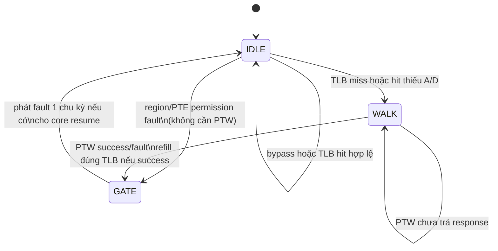
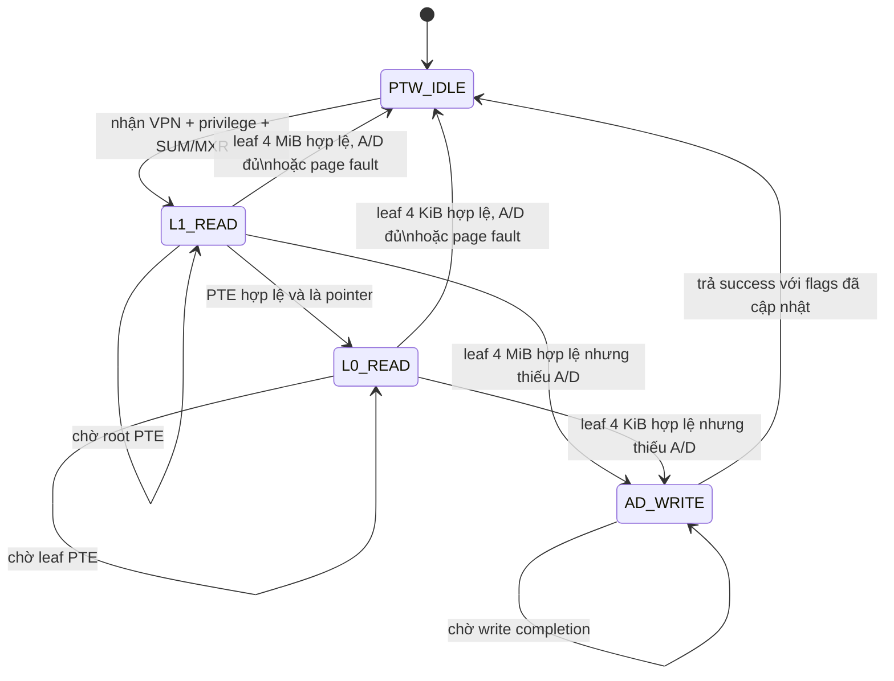

# FSM điều khiển MMU

Tài liệu này mô tả đúng RTL hiện tại trong `Risc_V/rtl/mmu_top.v` và
`Risc_V/rtl/mmu_ptw.v`. MMU dùng hai FSM lồng nhau: FSM ngoài phân xử yêu cầu
iTLB/dTLB và tạo nhịp fault/resume; FSM trong thực hiện page-table walk và cập nhật
bit Accessed/Dirty.

## 1. FSM điều phối ở `mmu_top`

| State | `busy` | Hành động chính | Điều kiện rời state |
|---|---:|---|---|
| `IDLE` | 0 khi không có vấn đề; lên 1 ngay trong chu kỳ phát hiện | Dịch tổ hợp trên hit; kiểm tra region, R/W/X, U/S, SUM/MXR và A/D. D-side được ưu tiên nếu I/D cùng cần xử lý. | Hit hợp lệ: giữ `IDLE`; fault chắc chắn: `GATE`; miss hoặc cần sửa A/D: `WALK`. |
| `WALK` | 1 | Bus D-memory thuộc PTW. Latch VA/VPN và loại request; chờ `ptw_resp_valid`. | Response thành công: refill iTLB/dTLB 4 KiB hoặc super-TLB tương ứng rồi `GATE`; response lỗi: ghi cause rồi `GATE`. |
| `GATE` | 0 | Một chu kỳ resume. `fetch_fault` hoặc `mem_fault` chỉ pulse tại đây; store fault bị chặn và fetch fault bị thay bằng NOP trong wrapper. | Luôn về `IDLE` ở cạnh clock kế tiếp. |

Logic quyết định trong `IDLE`:

1. Data-side có ưu tiên hơn instruction-side để không làm mất store/load đang ở M-stage.
2. Vi phạm coarse region hoặc quyền thật sự của PTE đi thẳng `GATE` với
   `FAULT_PERM`; không đọc page table lần nữa.
3. TLB miss đi `WALK`.
4. TLB hit có quyền đúng nhưng `A=0`, hoặc store hit có `D=0`, cũng đi `WALK` để
   PTW ghi lại PTE; không được biến trường hợp này thành permission fault.
5. `mmu_enable=0` là VA=PA bypass hoàn toàn.

## 2. FSM page-table walker ở `mmu_ptw`

| State | Bus operation | Kiểm tra/hành động |
|---|---|---|
| `PTW_IDLE` | Không có | Chỉ nhận một request khi `ready=1`; latch VPN, store/fetch, privilege, SUM/MXR và root PPN. |
| `L1_READ` | Read root PTE | `!V` → not-present; `R=0,W=1` → reserved; pointer → đọc L0; leaf → kiểm tra căn hàng 4 MiB (`PPN[9:0]=0`), quyền và A/D. |
| `L0_READ` | Read leaf PTE | Kiểm tra valid/reserved/leaf, quyền U/S + R/W/X + MXR/SUM và A/D cho trang 4 KiB. |
| `AD_WRITE` | Write đúng PTE vừa đọc | Set `A=1`; nếu store thì set thêm `D=1`. Chỉ trả success sau `mem_valid` của write. |

## 3. Quy tắc quyền

| Access | U-mode | S-mode | M-mode |
|---|---|---|---|
| Fetch | Cần `U=1` và `X=1` | Cần `U=0` và `X=1`; SUM không ảnh hưởng fetch | Bình thường không đi qua MMU vì `satp` bị bypass ở M-mode |
| Load | Cần `U=1`; cần `R=1` hoặc `MXR=1 && X=1` | Trang S luôn được phép theo R/MXR; trang U chỉ khi `SUM=1` | Bypass |
| Store | Cần `U=1`, `W=1`, `A=1`, `D=1` | Trang U cần thêm `SUM=1`; trang S không cần SUM | Bypass |

## 4. TLB và superpage

- Trang 4 KiB dùng iTLB/dTLB 16 entry, 4 set × 4 way, tree-PLRU.
- Trang 4 MiB dùng iTLB/dTLB superpage riêng, mỗi bên 4 entry fully-associative.
- Superpage so `VPN[19:10]`; PPN hiệu dụng là `{PTE.PPN[19:10], VPN[9:0]}`.
- `SFENCE.VMA`, reset hoặc `flush` xóa valid của cả TLB 4 KiB lẫn super-TLB.
- Nếu phần mềm đổi page size/mapping, bắt buộc `SFENCE.VMA`; RTL ưu tiên entry 4 KiB
  nếu entry cũ 4 KiB và superpage cùng tồn tại.

## 5. Bất biến dùng để review/debug

- Tại mọi thời điểm chỉ có một PTW request đang chạy.
- `ptw_mem_we=1` chỉ trong cập nhật A/D; mọi PTE access là word 32 bit.
- TLB chỉ refill sau khi A/D write đã hoàn tất.
- Fault chỉ pulse ở `GATE`, đúng một chu kỳ; `busy=0` tại `GATE` để core tiêu thụ
  fault và resume đồng bộ.
- Debug buffer chỉ được sinh khi `DEBUG_TRACE_ENABLE=1`; board build mặc định loại bỏ
  buffer này.

